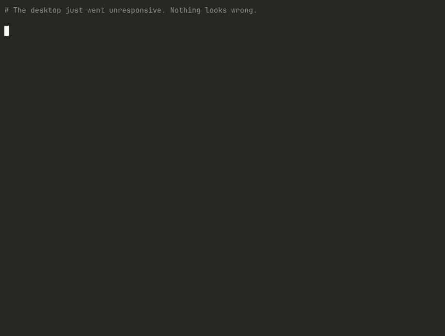

# stallwatch

[](https://github.com/varbees/stallwatch/actions/workflows/ci.yml)
[](https://crates.io/crates/stallwatch)

**Your Linux desktop freezes. `htop` says the CPU is idle and you have free RAM. So what stopped?**



*Not staged — a real `dd` saturating a real NVMe, diagnosed live. `free` and
`uptime` report a healthy machine; `/proc/pressure` proves it is frozen but
cannot say on what; stallwatch names the unit, then the process inside it.*

```console
$ stallwatch
Over the last 2.0s, these units stalled the system:

    77.7%  io      com.mitchellh.ghostty  — frozen 1569ms waiting on io
    12.9%  io      systemd-journald       — frozen  261ms waiting on io
     7.5%  io      backup.service         — frozen  152ms waiting on io

  worst cgroup: /sys/fs/cgroup/user.slice/user-1000.slice/user@1000.service/
                app.slice/app-com.mitchellh.ghostty.service

  most of the IO: backup.service moved 34 MiB and was barely blocked itself (8%)
  also moving data: systemd-journald (27 MiB)

   · btrfs [transient]: working through an async discard (TRIM) backlog: 65150
     extents / 1.1 GiB still queued after a large delete. This runs in the kernel,
     so the disk looks busy while no process shows IO delay. It clears on its own
     — do not go hunting for a runaway program. Roughly 2 min at the 1000 IOPS limit.
```

The last two lines are the ones nothing else prints. The terminal is stalled
77% of the window and is moving no data: it is the casualty. The unit moving
data while barely blocked is what stopped it.

No privileges. No dependencies. A 432 KB binary, or 516 KB fully static. The
daemon is optional and only needed for history.

---

## Why utilisation lies

Every monitor you have shows **utilisation** — what fraction of a resource is in use. That number cannot tell "working fine" from "completely jammed":

```
cpu   some avg10=1.6     ← CPU is idle
io    full avg10=51.3    ← everything is frozen half the time
```

A CPU graph reports a healthy machine here. In fact, for 51% of the last ten seconds, *every non-idle task on the system was blocked*.

Linux has measured this since 4.20 — **Pressure Stall Information**: how much time tasks spent unable to proceed. `some` means at least one task was blocked; `full` means every non-idle task was blocked at once. And crucially, the kernel writes `cpu.pressure`, `memory.pressure` and `io.pressure` into **every cgroup**, so the data to name a culprit has always been there.

Almost nothing reads it. htop, node_exporter and KDE's system monitor all surface the system-wide `/proc/pressure/*` files and stop. You learn *that* the machine stalled, never *who* stalled it.

That gap is what this fills.

## What it does that other PSI tools don't

**Names the responsible unit.** Kernel accounting is hierarchical — a stall inside `firefox.scope` also counts against `app.slice`, `user@1000.service`, `user.slice` and the root. Report that naively and the answer is always `user.slice`, which helps nobody. stallwatch walks the tree and blames a cgroup only when no single child owns ≥80% of its stall.

**Measures deltas, not averages.** `avg10/60/300` are exponentially damped, so a one-second freeze is smeared into a bump by the time you look. Each PSI file also carries `total=` — raw microseconds since boot. Sample it twice over a known monotonic window and you get the truth for exactly that window.

**Explains causes the numbers can't.** Three conditions produce identical-looking IO pressure and no desktop tool surfaces any of them:

| Condition | Why it's baffling without help |
|---|---|
| btrfs allocation exhaustion | `df` shows free space; the allocator has none. Deleting files doesn't help — freeing data inside a chunk doesn't release the chunk. |
| Async discard (TRIM) backlog | Disk 48% busy, **zero** processes with IO delay, because the work is kernel-side. Transient. |
| Drive at its thermal limit | Real mechanism — but only if the drive's throttle counters are non-zero. Usually they aren't. |

## Install

```sh
curl -fsSL https://antharmaya.com/tools/stallwatch/install.sh | sh
```

Puts two static binaries in `~/.local/bin`. No sudo, no package manager, and
every download is checked against the `SHA256SUMS` published with the release —
a mismatch aborts rather than installs. x86_64 and aarch64.

```sh
cargo install stallwatch
cargo build --release             # from a clone
```

Needs a kernel with `CONFIG_PSI=y` (near-universal). If your distribution builds with `CONFIG_PSI_DEFAULT_DISABLED=y` — openSUSE historically did — add `psi=1` to the kernel command line.

## Usage

```sh
stallwatch                    # one-second snapshot
stallwatch --watch            # refresh until Ctrl-C
stallwatch --window 3000      # three-second window
stallwatch --json             # machine-readable
stallwatch --processes        # drill into processes inside the guilty cgroup
stallwatch doctor             # what this machine lets it see
stallwatch --version
```

### Cause and victim

Pressure measures who is **blocked**. A process saturating a queue is not itself
waiting on it, so a report built only on pressure names the casualty every time.
Separating the two needs a second measurement: bytes actually moved.

```console
  most of the IO: backup.service moved 34 MiB and was barely blocked itself (8%)
```

That comes from `io.stat`, which sits in the same cgroup directory as the
`io.pressure` above and is readable without privileges — including for
root-owned services.

**This is cgroup-level, not process-level, and that distinction is load-bearing.**
An earlier version read `/proc/<pid>/io` to find the causing *process*. That file
returns `EACCES` for any process you do not own, and the processes that stall a
machine are kernel threads and root daemons — `kworker/*`, `systemd-journald`,
`mount.*`, `irq/*`. So the cause branch was unreachable: across 520,155 incidents
recorded on one desktop over 29 days it fired **zero times**, and every report
looked confident and complete while it did so. The demo that shipped with it only
worked because the `dd` in it belonged to the person running it.

A cgroup is a systemd unit and a unit is what you act on, so unit-level
attribution is the useful granularity anyway. `--processes` still drills into
processes and still reports their bytes where they are readable — as
corroboration, never as the thing the verdict depends on.

Two limits worth knowing:

- **A short-lived culprit may only be attributable to its parent.** A transient
  scope that exits mid-window is torn down and takes its `io.stat` with it, so
  the bytes land on the enclosing slice — `all user apps` rather than the
  command you ran. Sustained load attributes precisely; a one-second burst may
  not.
- **The root cgroup is never named as a cause.** It aggregates the machine, so
  it always has the largest byte count and can never be acted on. When its total
  is much larger than anything nameable, that is reported as its own finding:
  the work is kernel-side, or in cgroups with no `io.stat`.

`delayacct_blkio_ticks` would give exact per-process blocking time, but it is off
by default since 5.14 (`kernel.task_delayacct=0`) so it is used when present and
never depended on.

### Checking what it can actually see

The failure above was invisible for a month because nothing ever asked whether
the evidence existed. `doctor` asks, and says what each answer costs:

```console
$ stallwatch doctor
What stallwatch can and cannot see on this machine:

  ✓ cgroup v2                  mounted at /sys/fs/cgroup
  ✓ kernel PSI                 /proc/pressure present
  ✓ per-cgroup pressure        186 of 186 cgroups expose io.pressure
  ✓ per-cgroup io.stat         167 of 186 cgroups expose io.stat
  ! /proc/<pid>/io             readable for 122 of 398 processes (31%)
      Per-process byte evidence is unavailable for kernel threads and root
      daemons. Cause attribution uses cgroup io.stat instead, which is
      unit-level. This is expected, not a fault.
  ! PSI triggers (per-cgroup)  refused: Permission denied — normal without privileges
      Capture is woken by system-wide pressure and attributed afterwards, so a
      stall confined to one cgroup may not wake it.
```

The daemon runs the same checks at startup and logs anything reduced.

### "What just happened?"

A freeze is over by the time you can open a terminal and type. Live sampling
structurally cannot answer the question people actually ask, so `stallwatchd`
records continuously into a bounded ring and `--since` queries it:

```console
$ stallwatch --since 45
Over the last 45.0s, these units stalled the system:

    78.5%  io      com.mitchellh.ghostty  — frozen 22476ms waiting on io   (worst tick 91%)
    12.4%  io      systemd-journald       — frozen  3553ms waiting on io   (worst tick 17%)
     0.2%  memory  whole system           — frozen    59ms waiting on memory  (worst tick 11%)
```

That last row is why the daemon reports **peak per tick** and not just the
average. 0.2% reads as "nothing happened"; the 11% peak says there was a real
moment of memory pressure. Averaging over a long window destroys short events —
the same damping that makes the kernel's own `avg300` useless for catching
freezes. Ranking and noise-filtering are both done on the peak for this reason.

```sh
stallwatchd &                                  # foreground trial
cp systemd/stallwatchd.service ~/.config/systemd/user/
systemctl --user enable --now stallwatchd      # keep it running
```

**3.0 MB resident, 0.90% of one core** (measured over 30s: 9.0ms CPU per sweep
at the 1Hz floor). It runs at idle IO priority and `Nice=10` — a tool that
exists to observe contention must never cause any.

That principle needed enforcing, not just stating. The daemon retains the
previous snapshot so each tick costs **one** sweep of the cgroup tree instead
of two, and it paces itself from measured sweep cost against a duty-cycle
budget (`--duty`, default 2%) rather than assuming one tick fits every machine.
A sweep is ~10ms across 152 cgroups; on a 2,000-cgroup Kubernetes node it is
over a hundred, where a fixed 1Hz tick would have burned ~26% of a core. When
pacing diverges from `--tick` the daemon says so, because silently sampling at
a third of the requested rate would make every number quietly wrong.

The socket is `$XDG_RUNTIME_DIR/stallwatch.sock`, mode `0600`, and the protocol
is one line in and one document out — `socat` is a valid client:

```console
$ printf 'SINCE 60 text\n' | socat - UNIX-CONNECT:$XDG_RUNTIME_DIR/stallwatch.sock
$ printf 'PING\n'          | socat - UNIX-CONNECT:$XDG_RUNTIME_DIR/stallwatch.sock
PONG
```

### Varlink (systemd-native IPC)

The daemon also speaks [Varlink](https://varlink.org) on
`$XDG_RUNTIME_DIR/stallwatch.varlink`, so it is queryable by `varlinkctl`,
which ships with systemd — no bespoke client:

```console
$ varlinkctl call $XDG_RUNTIME_DIR/stallwatch.varlink \
      dev.stallwatch.Monitor.GetHistory '{"seconds":30}'

$ varlinkctl introspect $XDG_RUNTIME_DIR/stallwatch.varlink dev.stallwatch.Monitor
```

**Why Varlink and not D-Bus.** D-Bus was the obvious choice and it was the
wrong one: speaking it means either a `zbus` dependency and its crate graph, or
hand-rolling SASL auth and type marshalling. The first breaks the zero-dep
property that keeps this engine reducible to a C ABI; the second is a lot of
security-sensitive code to own. Varlink is JSON objects separated by NUL bytes
over a Unix socket — no handshake, no marshalling, no dependency. systemd 258
ships dozens of `io.systemd.*` Varlink services, so this is the direction the
platform is already moving.

### Prometheus / SRE

**Not a differentiator, and deliberately not the identity.** Kubernetes ships PSI
metrics at node, pod and container granularity — `container_pressure_*` via the
kubelet and cAdvisor — stable and locked on since v1.36, first available in
v1.33. If you are running Kubernetes, that stream already exists and is better
placed in the stack than anything here. This exporter is kept because it is
cheap, already built, and useful on a machine that is not a cluster node.

```sh
stallwatchd --metrics-listen 127.0.0.1:9836          # scrape http://…/metrics
stallwatchd --metrics-textfile /var/lib/node_exporter/textfile/stallwatch.prom
```

```
stallwatch_pressure_waiting_seconds_total{unit="systemd-journald",cgroup="…",resource="io"} 41.7
stallwatch_pressure_stalled_seconds_total{unit="systemd-journald",cgroup="…",resource="io"} 12.9
stallwatch_btrfs_unallocated_bytes{fsid="…"} 13909415424
stallwatch_drive_temperature_celsius{device="nvme",sensor="Composite"} 53.9
```

**Counters, not deltas.** The CLI reports deltas because humans want "frozen
858ms in the last second". Prometheus wants the opposite — a monotonic counter
it differentiates with `rate()`. PSI's `total=` already *is* that counter, so
the exporter reads raw totals rather than reusing the attribution path.
Naming follows the `waiting`/`stalled` vocabulary cAdvisor and Kubernetes
settled on, so anything already ingesting `container_pressure_*` finds nothing
surprising.

**Cardinality is taken seriously**, because it is what takes down a Prometheus.
systemd mints a fresh transient scope per shell command — an unbounded label
space. Cgroups with zero accumulated pressure are skipped, series are capped
(`--max-series`, default 500), and `stallwatch_series_dropped` reports what was
withheld. A silent cap is a lie.

Only drive sensors that publish their own `_crit` threshold are exported.
Auxiliary sensors read high on healthy hardware and would alert on nothing.

## As a library

The engine is a library; the CLI is one thin client of it. The JSON above *is* the schema, and it is deliberately aligned with the vocabulary Kubernetes and cAdvisor already settled on (`container_pressure_*`, where `waiting` is PSI `some` and `stalled` is PSI `full`).

```rust
use std::time::Duration;

let report = stallwatch::observe(Duration::from_secs(1));
for stall in &report.stalls {
    println!("{} stalled {}ms on {}", stall.unit, stall.delta_usec / 1000, stall.resource);
}
for w in &report.warnings {
    println!("[{}] {}", w.severity, w.message);
}
```

## Design commitments

**No privileges.** Everything comes from `/sys` and `/proc` as the invoking user. A diagnostic that needs root is a diagnostic people don't run.

**No dependencies.** `std` only. This is load-bearing rather than aesthetic: the engine must stay reducible to a C ABI, because the projects best placed to consume it — btop, ksystemstats, GNOME's system monitor — are C and C++ and will not accept a Rust crate graph in their build.

**Never claim causation from correlation.** This one was learned expensively. An early thermal check saw a drive sensor at 97 °C and confidently reported thermal throttling as the cause of an IO stall. The drive's own counters — `Thermal Management T1/T2 Trans Count`, `Warning Temperature Time` — were all zero across 4,979 power-on hours. It had never throttled once. The sensor reading was real, the mechanism was plausible, the conclusion was wrong, and it cost hours.

That heuristic would also have fired on every healthy drive of the same family. So the rule now is: report the observation, name the command that settles it, let the human conclude. Sensors that publish no threshold are never warned on at any temperature.

**It never fixes anything.** stallwatch is read-only. It prints the command *you* might run and shows the exact `/sys` path every number came from, so you can re-read the kernel and check its arithmetic. It is an instrument, not an optimiser.

## Containers and Kubernetes

Verified on Debian 11, Ubuntu 20.04 and Alpine 3.19 using the static musl
binary — no glibc, no systemd required to *run*.

```sh
# A container sees only its OWN cgroup by default, whose pressure reads zero.
# Mount the host tree read-only and attribution works, unprivileged:
podman run --rm -v /sys/fs/cgroup:/sys/fs/cgroup:ro stallwatch
```

A `DaemonSet` needs nothing more than that read-only `hostPath` — no privileged
mode, no capabilities, no host PID namespace. See [`deploy/daemonset.yaml`](deploy/daemonset.yaml).

**Two traps worth knowing.** Without the mount, stallwatch reports "no stalls"
while the node is on fire, because the container's own cgroup genuinely is idle.
And `/proc/pressure` is **not namespaced** — a container reading it sees the
host's values with no indication that they aren't its own.

## Limitations

- **cgroup v2 only.** No v1 fallback.
- **systemd naming.** Attribution works anywhere cgroup v2 does, but the
  human-readable names assume systemd's layout. On OpenRC/runit you get raw
  cgroup paths.
- **Cause attribution is unit-level, not process-level.** See
  [Cause and victim](#cause-and-victim). Per-process bytes are only readable for
  your own processes, so they are corroboration, never the verdict.
- **A culprit that exits mid-window may only be attributable to its parent.**
  Its cgroup is torn down with it.
- **Per-cgroup PSI triggers need privilege.** System-wide triggers work
  unprivileged; `io.pressure` inside a cgroup returns `EACCES`. So capture is
  woken by system-wide pressure and attributed afterwards, and a stall confined
  to a single cgroup may not wake it at all. `stallwatch doctor` reports this.
- **`frozen Nms` is bounded by the capture window.** The daemon samples for a
  fixed window, so the figure says how much of *that window* was lost, not how
  long a freeze lasted. Notifications deliberately do not quote it: across
  520,209 recorded incidents only 3 ever exceeded one second, because the window
  was 400ms.
- **Per-process drill-down is a second window.** `--processes` cannot know which
  cgroup is guilty until the first pass finishes, so it samples again straight
  after. For a sustained stall that is fine; a one-off spike may be gone, and it
  says so rather than implying otherwise.
- **No D-Bus.** The daemon speaks a Unix socket and Varlink. D-Bus would be
  either a dependency or a large amount of hand-rolled protocol, and zero
  dependencies is what keeps the engine reducible to a C ABI.
- **Thermal checks cannot see throttle counters**, which need root. Hence the
  deliberate caution above.

## Roadmap

1. ~~Daemon with a ring buffer~~ — done
2. ~~D-Bus interface~~ — solved with Varlink instead, at zero dependency cost
3. ~~Per-process drill-down~~ — done
4. ~~Name the cause, not just the victim~~ — done, via cgroup `io.stat`
5. ~~Self-diagnosis~~ — done, `stallwatch doctor`
6. More pathologies: zram/zswap saturation, ZFS ARC pressure, dm-thin
   exhaustion, NVMe SMART wear

## License

MIT ([LICENSE-MIT](LICENSE-MIT)) or Apache-2.0 ([LICENSE-APACHE](LICENSE-APACHE)),
at your option.
